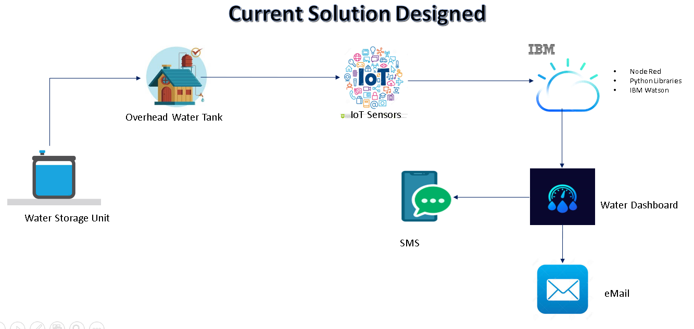
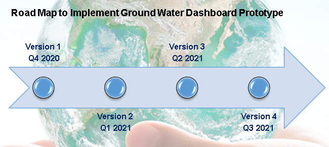

# ICC2020

Call For Code 2020 Ideation Proposed

## Contents

1. [Short description](#short-description)
1. [Demo video](#demo-video)
1. [The architecture](#the-architecture)
1. [Long description](#long-description)
1. [Project roadmap](#project-roadmap)
1. [Live demo](#live-demo)

## Short description

### What's the problem?

Water is at the core of sustainable development and is critical for socio-economic development, healthy ecosystems and for human survival itself. Today, the main water source for over 2 billion people are aquifers – underground stores of freshwater. It is estimated that by 2025 almost half of the urban population will live in water-stressed areas as this precious commodity is becoming scarce rapidly.

### How can technology help?

Emerging Information Technology will give more benefits for a Common Man and Community in order to Analyse,Predict the Scarcity and save the Natural resources. Water is being an essential part in our day-to-day life needs to be saved with the help of Internet of Things.

### The idea

With the help of IoT sensors, Cloud technology and Machine Learning algorithms, we are proposing a solution, that will provide us to understand the relation between total storage / groundwater available in a particular zone / community / individual residence, quantity of water used, quantity of water wasted (leakage) and the quantity of water recharged back to the source. With the obtained data, we can predict and alert the common people / authorities.

## Demo video

[![Watch the video]

## The Architecture

Points:

1. The user navigates to the site and uploads a video file.
2. Watson Speech to Text processes the audio and extracts the text.
3. Watson Translation (optionally) can translate the text to the desired language.
4. The app stores the translated text as a document within Object Storage.

## Long description

# Why we Choose this Idea

India has largely been Monsoon dependent for its agricultural/drinking water needs and have been blessed with abundant rainfall until recently. A trend observed in the recent years has been increasing dependence of agricultural irrigation on ground water resources. Indian government had spent close to 16,000 crores in the thirty-five years between 1950 and 1985. As a result of this and green revolution, close to 67 percent of irrigation is currently done using groundwater resources.
Central Ground Water Board, responsible for monitoring the ground water resources collects information from 15,640 observation wells as a representation for 30 million ground water resources. This under representation is critical especially since ground water resources typically suffer from a “Out of sight, out of mind” attitude until the bore well runs out one fine day. Not just ground water, drinking water supplied by the corporation suffers from a similar set of issues in most parts of the country. We want to use data and analytics to give the people a sense of the limits of water resource they have access to hence the decision to work on water sustainability.
Our short-term solution is to focus on water consumption, usage, recharge rates, project these data to the end user, and make them cognizant of their water usage. To educate and provide them with a fair idea of their usage and indicate periodically on their usage and how long they can continue with the same kind of usage without running out. The long-term solution involves using these data, anonymize it and to enrich the dataset government works with, to enable better monitoring and reporting of our underwater resources.

## Solution Approach

Our solution aims at providing a detailed view on usage of water in households. Monitoring the hourly usage of water, we are providing insights on their usage and prediction on how far with past trend of usage, the household can sustain with available water. The solution also provides periodic warnings in messages and mails to the house residents to make the water usage more economical. Therefore, with constant monitoring and periodic intimation of water usage, we are aiming to create awareness to public on water utilization and to achieve economic usage of water.

To achieve the above, we have created a prototype by implementing our solution to an individual house. 

IBM Cloud Services used:
1)	IBM Watson IoT 
2)	Node- Red
3)	Cloudant Data base
4)	Cloud Object Storage
5)	IBM Watson Machine Learning
6)	IBM Watson Assistant

Water usage from various IoT sensor devices will be transmitted to IBM cloud and the data is stored in Cloudant database with timestamp. Here we are simulating the data in Watson IoT from Node-Red and uploading to Cloudant database. With this periodic data on water usage, alerts will be send if usage is higher than a pre-defined threshold value. Updating the consolidated usage in another database. We have consolidate the available water recharge in terms of percentage of water usage, water availability is calculated and updated in database on daily basis. ML models are created using IBM Auto AI feature based on seasons (summer, winter, autumn and spring).  Prediction results are obtained based on the previous water utilization data, which in turn will produce a water prediction dashboard to indicate the end user on their usage.

## Project roadmap

## Built with

# IBM Services to be deployed
	Node-Red
	Watson IoT
	Watson Studio
	Cloudant DB - With 4 databases
		1- db_water_store
		2- db_houseicc2020_usage
		3- houseicc_daily_usage
		4- General DB - for storing node red flows
	Watson chatbot
	Twilio service

# Nodes to be installed in Node Red
	node-red-dashboard
	node-red-contrib-ibm-watson-iot
	node-red-contrib-python3-function
	node-red-contrib-sms-twilio
	node-red-contrib-watson-machine-learning
	node-red-node-cf-cloudant
	node-red-node-watson
	
# External accounts
	A trial account in Twilio to send SMS

# Auto AI experiments
	Trained fours ML models in Watson Auto AI.

>>Provided node red json fow. Import the flow in node red.

# Changes to be made in flow to run in any Node red ****

>> Update the IoT sensor details as per your deployed service.
>> Update the Cloudant DB instance.
>> Update the Twilio account.
>> Update ML model instance ID and API key

# Short Description

Water usage in a house varies based on time. So, simulation of usage data (to be synchronous with original data) should be done based on time. Input to Watson IoT simulated sensor is given from Node red based on current timestamp. The sensor data uploaded to Watson IoT is transferred to Node red and the data is uploaded in Cloudant DB - "db_houseicc2020_usage" with current date and timestamp. At every day 00:00 am the cosolidated water usage of previous day is calculated and is updated in another cloudant DB - "houseicc_daily_usage" With the obtained data for consolidated water usage, a ML model is created in Watson Auto AI.
A parameter called "Water Recharge" which refers the amount of water that is getting recharged back to ground so as to enhance current solution to ground water is also taken into account.
	
# Recharge Calculation 
Recharge will depends on following factors:
		>. Evaporation - which depends on temperature
		>. Humidity
		>. Rainfall and 
		>. Rocks and soil texture in an area
		>. Type of usage - (Household, Industries or Agriculture etc..,)
	So, Considering the above factors we concluded to take recharge as percentage of usage that depends on various seasons (Summer, Winter,Autumn,Spring) - (Which determines temerature, humidity and rainfall)
	
>> The proposed solution finds complexity in calculating actual ground water. So, repacing ground water to central water storage. (Ground water calculation will be taken care in future)

>> ML models are trained and deployed and is connected to node red.

>> Prediction of Day Zero is done and a dashboard is generated for end users.

>> Leakage sensors are simulated from Watson IoT and the data is transmitted to node red.

>> Periodic SMS is also configured for Leakage. 

# Note: Views are created to filter required data from Cloudant DB. The code for views is also provided.

