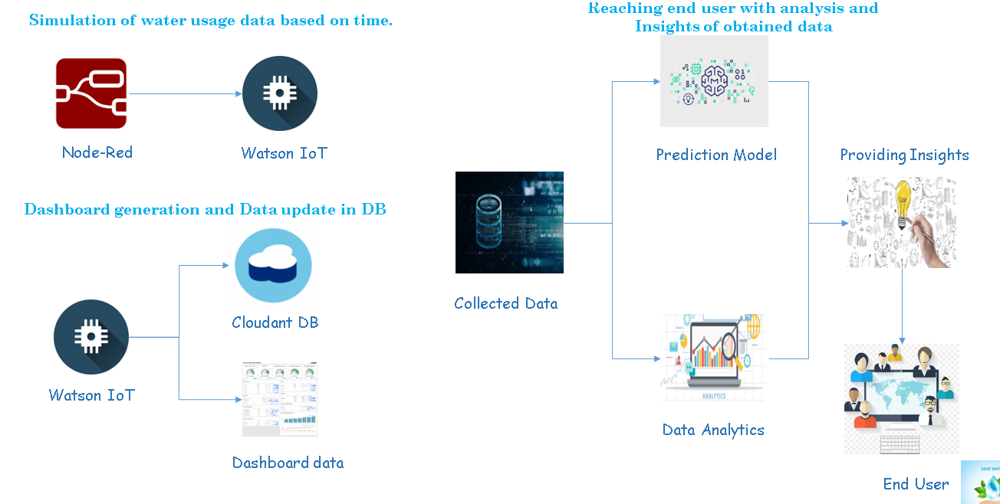

# ICC2020

A basic GitHub repository example for Call for Code submissions and those projects that join the Code and Response initiative. Not all sections or files are required. You can make this as simple or as in-depth as you need.

*Read this in other languages: [English](README.md), [한국어](README.ko.md), [português](README.pt_br.md).*

## Contents

1. [Short description](#short-description)
1. [Demo video](#demo-video)
1. [The architecture](#the-architecture)
1. [Long description](#long-description)
1. [Project roadmap](#project-roadmap)
1. [Live demo](#live-demo)

## Short description

### What's the problem?

Water is at the core of sustainable development and is critical for socio-economic development, healthy ecosystems and for human survival itself. Today, the main water source for over 2 billion people are aquifers – underground stores of freshwater. It is estimated that by 2025 almost half of the urban population will live in water-stressed areas as this precious commodity is becoming scarce rapidly.

### How can technology help?

Emerging Information Technology will give more benefits for a Common Man and Community in order to Analyse,Predict the Scarcity and save the Natural resources. Water is being an essential part in our day-to-day life needs to be saved with the help of Internet of Things.

### The idea

With the help of IoT sensors, Cloud technology and Machine Learning algorithms, we are proposing a solution, that will provide us to understand the relation between total storage / groundwater available in a particular zone / community / individual residence, quantity of water used, quantity of water wasted (leakage) and the quantity of water recharged back to the source. With the obtained data, we can predict and alert the common people / authorities.

## Demo video

[![Watch the video]

## The Architecture

Points:

1. The user navigates to the site and uploads a video file.
2. Watson Speech to Text processes the audio and extracts the text.
3. Watson Translation (optionally) can translate the text to the desired language.
4. The app stores the translated text as a document within Object Storage.

## Long description

[More detail is available here](DESCRIPTION.md)

## Project roadmap

## Getting started

These instructions will get you a copy of the project up and running on your local machine for development and testing purposes. See deployment for notes on how to deploy the project on a live system.

## Live demo

IBM Watson Assistant (https://web-chat.global.assistant.watson.cloud.ibm.com/preview.html?region=eu-gb&integrationID=2ab06ab1-8c28-4b68-a8c7-10c8480531c5&serviceInstanceID=651a2d01-45ba-4f31-9f18-bc757f988366)

## Built with

**** IBM Services to be deployed ****
	Node-Red
	Watson IoT
	Watson Studio
	Cloudant DB - With 4 databases
		1- db_water_store
		2- db_houseicc2020_usage
		3- houseicc_daily_usage
		4- General DB - for storing node red flows
	Watson chatbot
	Twilio service

**** Nodes to be installed in Node Red ****
	node-red-dashboard
	node-red-contrib-ibm-watson-iot
	node-red-contrib-python3-function
	node-red-contrib-sms-twilio
	node-red-contrib-watson-machine-learning
	node-red-node-cf-cloudant
	node-red-node-watson
	
**** External accounts ****
	A trial account in Twilio to send SMS

**** Auto AI experiments ****
	Trained fours ML models in Watson Auto AI.

>>Provided node red json fow. Import the flow in node red.

**** Changes to be made in flow to run in any Node red ****

>> Update the IoT sensor details as per your deployed service.
>> Update the Cloudant DB instance.
>> Update the Twilio account.
>> Update ML model instance ID and API key

**** Short Description ****

>> Water usage in a house varies based on time. So, simulation of usage data (to be synchronous with original data) should be done based on time. Input to Watson IoT simulated sensor is given from Node red based on current timestamp.

>> The sensor data uploaded to Watson IoT is transferred to Node red and the data is uploaded in Cloudant DB - "db_houseicc2020_usage" with current date and timestamp.

>> At every day 00:00 am the cosolidated water usage of previous day is calculated and is updated in another cloudant DB - "houseicc_daily_usage"

>> With the obtained data for consolidated water usage, a ML model is created in Watson Auto AI.

>> A parameter called "Water Recharge" which refers the amount of water that is getting recharged back to ground so as to enhance current solution to ground water is also taken into account.
	
	**** Recharge Calculation ****
	>> Recharge will depends on following factors:
		>. Evaporation - which depends on temperature
		>. Humidity
		>. Rainfall and 
		>. Rocks and soil texture in an area
		>. Type of usage - (Household, Industries or Agriculture etc..,)
	So, Considering the above factors we concluded to take recharge as percentage of usage that depends on various seasons (Summer, Winter,Autumn,Spring) - (Which determines temerature, humidity and rainfall)
	
>> The proposed solution finds complexity in calculating actual ground water. So, repacing ground water to central water storage. (Ground water calculation will be taken care in future)

>> ML models are trained and deployed and is connected to node red.

>> Prediction of Day Zero is done and a dashboard is generated for end users.

>> Leakage sensors are simulated from Watson IoT and the data is transmitted to node red.

>> Periodic SMS is also configured for Leakage. 

Note: Views are created to filter required data from Cloudant DB. The code for views is also provided.

